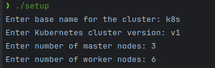
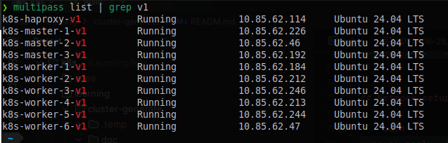
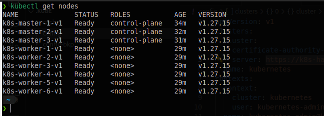

# Kubernetes Cluster Setup Script

This script automates the setup of a Kubernetes cluster using Multipass for virtual machines and HAProxy for load
balancing.

## Prerequisites

- **Multipass**: Ensure Multipass is installed on your machine. See [Multipass Install](https://multipass.run/install).

## Refenrences

- [Multipass](https://multipass.run/)
- [Docker install](https://docs.docker.com/engine/install/ubuntu/#install-using-the-convenience-script)
- [Creating Highly Available Clusters with kubeadm](https://v1-27.docs.kubernetes.io/docs/setup/production-environment/tools/kubeadm/high-availability/)
- [Installing kubeadm](https://v1-27.docs.kubernetes.io/docs/setup/production-environment/tools/kubeadm/install-kubeadm/)
- [Instalação com Kubeadm](https://highfalutin-vulture-304.notion.site/Instala-o-com-Kubeadm-8ce4f709872342ff848a4df77e53618d)
- [CRI-O](https://kubernetes.io/docs/setup/production-environment/container-runtimes/#cri-o)
- [LUNXXtips](https://www.youtube.com/watch?v=-wbtj11Mqvk&list=PLf-O3X2-mxDnw1xBcTpy4pGkIj_CyvI7B&index=1)

## Usage

1. **Clone the Repository:**

````bash
git clone https://github.com/eliasmeireles/ssh-test.git
cd learning/cluster-generate
````

2. **Run the Script:**

````bash
./setup.sh
````

## Options

- `--base-name`: Base name for the cluster (required).
- `--cluster-version`: Kubernetes cluster version (e.g., v1.27, required).
- `--num-masters`: Number of master nodes (required).
- `--num-workers`: Number of worker nodes (required).
- `--master-mem`: Memory for master nodes (default: 2G).
- `--master-cpus`: CPUs for master nodes (default: 2).
- `--master-disk`: Disk size for master nodes (default: 22G).
- `--worker-mem`: Memory for worker nodes (default: 4G).
- `--worker-cpus`: CPUs for worker nodes (default: 2).
- `--worker-disk`: Disk size for worker nodes (default: 32G).
- `--help`: Display help message.

## Example:

````bash
./setup.sh --base-name my-cluster --cluster-version v1.27 --num-masters 3 --num-workers 3 --master-mem 3G --worker-mem 6G
````

- This command will create a Kubernetes cluster named my-cluster, with version v1.27, 3 master nodes, and 3 worker
  nodes. Master nodes will have 3GB of memory, and worker nodes will have 6GB of memory.

- After all masters/workers and HAProxy are created, the script will execute the necessary Kubernetes setup commands to
  create a highly available
  cluster. [See](https://v1-27.docs.kubernetes.io/docs/setup/production-environment/tools/kubeadm/create-cluster-kubeadm/#join-nodes)

## Master node setup

> Execute commands in `sudo su` mode

````bash
- After run the command bellow, pay attention to the output, it will show the command to be executed to join on the
  masters and workers
  nodes.

````bash
kubeadm init --control-plane-endpoint $HAPROXY_NAME:6443 --upload-certs
````

## Network setup

````bash
kubectl apply -f https://github.com/weaveworks/weave/releases/download/v2.8.1/weave-daemonset-k8s.yaml
````

# Logging:

- Logs for each execution are stored in `./.temp` directory with filenames based on the timestamp of execution.

## Notes:

- The script assumes a Unix-like environment.
- Ensure you have sufficient resources (CPU, memory, disk space) on your host machine to run the virtual machines.
- Each node created will have the necessary configuration and Kubernetes setup executed via a transferred script (
  kub-config.sh).

## Example

- After completed the steps described in [Master node setup](#master-node-setup), you will see the output below:







## Cleanup:

- To delete all instances created by the script, use:

````bash
./delete-instances.sh <pattern>
````

- Replace <pattern> with a keyword that matches the instance names to delete.

## Author:

Created by [Elias Meireles](https://eliasmeireles.com/).
License:

